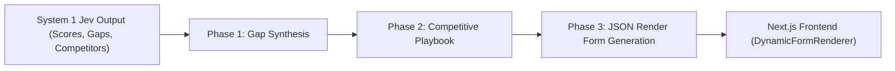

# System 2 Deep Analysis, Competitive Playbook & Dynamic JSON Render UI

Type: task
Status: resolved
Blocked by: 03

## Question

How should the System 2 LLM consume the Jev qualification assessment and raw notes to identify missing MEDDPICC dimensions, generate a targeted competitive playbook, and formulate dynamic SA qualification questions rendered in the Next.js frontend using Vercel JSON Render?

## Answer

### 1. System 2 Ingestion & Phased Execution

System 2 operates as the deep reasoning layer that builds upon the fast, structured output of System 1 (Jev). Rather than executing as a monolithic prompt, it executes across three sequential phases managed by the `DealQualificationAgent`:



#### Ingestion Contract:
```typescript
interface System2Input {
  opportunity: {
    id: string;
    name: string;
    stageName: string;
    amount: number;
    aeNotes: string;
    saNotes: string;
  };
  jevScores: JevScoringResult;
}
```

---

### 2. Phase Breakdown

#### Phase 1: Gap Synthesis & Risk Analysis (`phase = 'gap_analysis'`)
- **Input**: Focuses on dimensions where `status === 'unaddressed'` or `'partial'`, and dimensions flagged in `stageGate.gateBlockers`.
- **Reasoning**:
  - Distinguishes between what the customer *actually said* vs *what the AE assumed*.
  - Quantifies technical risk (e.g., "Customer has 45-minute build times on Turborepo, but has not validated whether caching is misconfigured or if remote cache is enabled").
- **Output**: Structured list of deal blind spots, each tagged with its MEDDPICC dimension and risk level.

#### Phase 2: Competitive Battlecard Synthesis (`phase = 'competitive_playbook'`)
- **Input**: Competitor entities detected by Jev (e.g. Netlify, AWS Amplify, Cloudflare Pages) plus raw note excerpts.
- **Reasoning**:
  - Leverages standard Vercel positioning battlecards from [`docs/meddpicc-rubric.md`](file:///Users/brandonwarwick/Documents/Workspace/vercel-sam-demo/docs/meddpicc-rubric.md).
  - Generates tactical "trap-setting" questions for the SA to ask during discovery calls.
- **Output**:
  - Competitor vulnerabilities.
  - Vercel proof points (e.g. Next.js App Router native streaming, Incremental Static Regeneration, Edge Middleware).
  - Prescribed technical questions to expose competitor limitations.

#### Phase 3: Dynamic Question Formulation (`phase = 'form_generation'`)
- **Input**: Synthesized gaps and competitive trap questions.
- **Reasoning**:
  - Translates the top 3–5 highest-priority qualification gaps into interactive form fields.
  - Groups fields logically: **Stage Gate Blockers**, **Competitive Validation**, and **Architecture & Metrics**.
- **Output**: Compliant Vercel JSON Render component tree.

---

### 3. Vercel JSON Render Specification (`lib/ui/json-render-schema.ts`)

The frontend renders questions directly from this declarative schema:

```typescript
import { z } from 'zod';

export const FormFieldOptionSchema = z.object({
  label: z.string(),
  value: z.string(),
  description: z.string().optional()
});

export const FormFieldSchema = z.object({
  id: z.string(),
  name: z.string(),
  label: z.string(),
  description: z.string().optional(),
  type: z.enum(['text', 'textarea', 'select', 'radio', 'checkbox_group']),
  placeholder: z.string().optional(),
  required: z.boolean().default(false),
  options: z.array(FormFieldOptionSchema).optional(),
  dimensionTarget: z.enum([
    'metrics',
    'economicBuyer',
    'decisionCriteria',
    'decisionProcess',
    'paperProcess',
    'identifyPain',
    'champion',
    'competition'
  ]),
  helpCallout: z.string().optional()
});

export const JsonRenderSectionSchema = z.object({
  id: z.string(),
  title: z.string(),
  description: z.string().optional(),
  calloutType: z.enum(['info', 'warning', 'tip']).optional(),
  calloutText: z.string().optional(),
  fields: z.array(FormFieldSchema)
});

export const JsonRenderFormSchema = z.object({
  opportunityId: z.string(),
  title: z.string(),
  summary: z.string(),
  sections: z.array(JsonRenderSectionSchema)
});

export type JsonRenderForm = z.infer<typeof JsonRenderFormSchema>;
```

---

### 4. Concrete Example Output: Acme Corp Scenario

```json
{
  "opportunityId": "opp_acme_corp_001",
  "title": "Technical Qualification & Competitive Strategy",
  "summary": "System 1 flagged high Pain and Champion alignment, but Stage 2 exit is blocked by unverified Economic Buyer authority and Netlify counter-offer renewal risks.",
  "sections": [
    {
      "id": "section_stage_gate",
      "title": "Stage Gate Blockers",
      "calloutType": "warning",
      "calloutText": "Stage 2 Exit Gate Blocked: Economic Buyer sign-off and verified build-time metrics are required before committing dedicated SA technical validation hours.",
      "fields": [
        {
          "id": "q_economic_buyer",
          "name": "economicBuyerRole",
          "label": "Who holds discretionary budget sign-off for the $180k ACV?",
          "type": "radio",
          "required": true,
          "dimensionTarget": "economicBuyer",
          "options": [
            { "label": "VP of E-Commerce (Confirmed in direct meeting)", "value": "vp_ecommerce_verified" },
            { "label": "Head of Platform (Only has recommendation authority)", "value": "head_platform_recommender" },
            { "label": "CFO / Finance committee signoff required", "value": "cfo_signoff_pending" },
            { "label": "Unknown / Unconfirmed", "value": "unknown" }
          ]
        },
        {
          "id": "q_metrics_verification",
          "name": "buildTimeBenchmark",
          "label": "Documented Current vs Target Build Performance",
          "type": "text",
          "placeholder": "e.g. Current: 45 min on Netlify; Target: <5 min with Turborepo Remote Cache",
          "required": true,
          "dimensionTarget": "metrics"
        }
      ]
    },
    {
      "id": "section_competitive",
      "title": "Competitive Counter-Positioning (Netlify)",
      "calloutType": "tip",
      "calloutText": "Netlify is offering a 30% renewal discount. Position Next.js 14 App Router ISR and Edge Middleware cold-start parity as exclusive technical differentiators.",
      "fields": [
        {
          "id": "q_netlify_trap",
          "name": "netlifyIsrPain",
          "label": "Has the customer experienced cache skew or ISR latency on Netlify?",
          "type": "select",
          "dimensionTarget": "competition",
          "options": [
            { "label": "Yes - Frequent cache invalidation delays impacting product drops", "value": "cache_skew_confirmed" },
            { "label": "No - Build queue concurrency is their primary complaint", "value": "build_queue_only" },
            { "label": "Not yet discussed with customer", "value": "untested" }
          ]
        }
      ]
    }
  ]
}
```

---

### 5. Next.js Frontend Component Architecture (`DynamicFormRenderer.tsx`)

The frontend renders the schema using standard Tailwind and UI primitives:
- **Zero Heavy Runtime Form Engines**: Maps component schemas directly to standard controlled input fields.
- **State Collection**: Collects inputs as `{ [fieldName: string]: any }`.
- **Submission Action**:
  - Submits payload to `POST /api/qualification/feedback`.
  - Dispatches to Ticket 05 feedback loop to re-score the deal via Jev and write back `suggested_next_steps` to Postgres.
