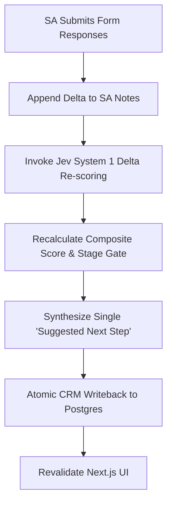
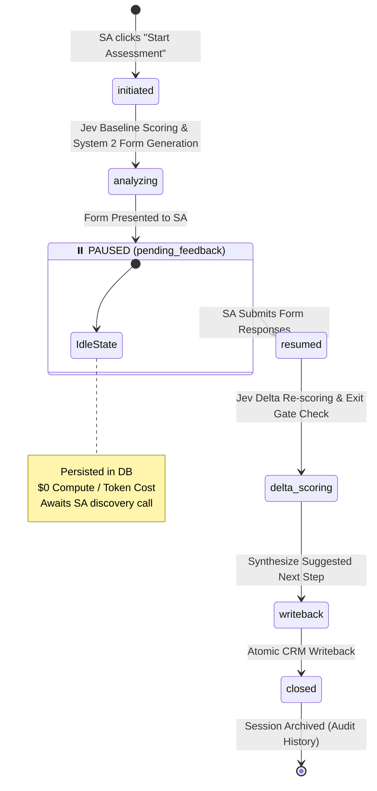

# SA Response Ingestion, Jev Re-scoring & CRM Writeback

Type: task
Status: resolved
Blocked by: 04

## Question

When the Solution Architect submits answers (or notes gaps) to the dynamic questions in the frontend, how does the system re-invoke Jev to re-score the deal, update the qualification status, synthesize the final "Suggested Next Step", and write back only that step into the mock Salesforce database while preserving agent state in Eve?

## Answer

### 1. SA Feedback Ingestion Architecture (`POST /api/qualification/feedback`)

When the Solutions Architect completes the dynamic JSON Render form and clicks "Submit Qualification Feedback", the Next.js frontend sends a structured payload to the feedback API endpoint:

```typescript
export interface SaFeedbackPayload {
  opportunityId: string;
  formResponses: Record<string, string | string[]>; // fieldId -> submitted value
  notesDelta?: string; // Optional manual observations from SA
}
```

#### Note Augmentation & Synthesis:
The feedback handler ingests the responses and synthesizes a structured log entry appended to the Opportunity's `sa_notes`:
```typescript
const formattedDelta = `
[SA Discovery Update - ${new Date().toISOString()}]
${Object.entries(formResponses)
  .map(([fieldId, val]) => `• ${fieldId}: ${Array.isArray(val) ? val.join(', ') : val}`)
  .join('\n')}
${notesDelta ? `• Additional SA Notes: ${notesDelta}` : ''}
`.trim();

const updatedSaNotes = existingOpportunity.saNotes
  ? `${existingOpportunity.saNotes}\n\n${formattedDelta}`
  : formattedDelta;
```

---

### 2. Delta Re-scoring with Jev (System 1)

The agent immediately triggers `run_jev_scoring` with the augmented notes:



1. **Rubric Re-evaluation**: Jev ingests the combined AE notes and updated SA notes.
2. **Dimension Delta**: Missing dimensions (e.g. Economic Buyer moving from `unaddressed` $\rightarrow$ `verified`) receive upgraded scores.
3. **Stage Gate Progression**:
   - Re-evaluates exit criteria for the Opportunity's current `stageName`.
   - Computes whether `gateReady` is now `true` or remains `false`.
4. **Qualification Status Mapping**:
   - If `stageGate.gateReady === true`: Set `qualification_status = 'qualified'`.
   - If `stageGate.gateReady === false` but composite score improved: Set `qualification_status = 'in_review'`.
   - If fatal blocker surfaced (e.g. customer locked into 3-year competitor renewal): Set `qualification_status = 'disqualified'`.

---

### 3. Synthesis of the Final "Suggested Next Step"

To keep the CRM writeback clean and actionable for field teams, the agent synthesizes a single, standardized directive formatted as:
`[<STATUS>] <Immediate Milestone Action> | Owner: <AE/SA> | Focus: <Core Technical or Business Value> | Watch: <Risk/Competitor>`

#### Concrete Output Examples:

- **Stage 2 $\rightarrow$ 3 Gate Passed (e.g. Acme Corp)**:
  `"[QUALIFIED] Advance to Stage 3 (Technical Validation). Schedule 60-min deep dive with VP of E-Commerce to demonstrate Turborepo Remote Caching and Next.js 14 App Router ISR cache-invalidation; prepare POC preview environment on Vercel Enterprise. | Owner: SA (Lead) + AE | Watch: Netlify 30% discount renewal offer."`

- **Stage 2 Gate Blocked (Gaps Remain)**:
  `"[IN REVIEW] Hold at Stage 2. Do not commit dedicated SA architecture resources until Economic Buyer authority is verified. AE to schedule 30-min budget alignment call with VP of E-Commerce. | Owner: AE | Watch: AWS EDP credit subsidies."`

- **Deal Disqualified**:
  `"[DISQUALIFIED] Archive opportunity. Customer confirmed strict on-premise container mandate with no edge CDN adoption feasible within 12 months. | Owner: AE | Watch: Self-hosted DIY Kubernetes."`

---

### 4. Targeted Database Writeback (`db/crm.ts`)

In accordance with system specifications, the agent writes back **ONLY** the designated `suggested_next_steps` column (along with the updated qualification metrics and timestamps). Raw AE notes are strictly preserved and untouched:

```sql
UPDATE opportunities
SET 
    sa_notes = $1,
    suggested_next_steps = $2,
    qualification_status = $3,
    meddpicc_score = $4,
    meddpicc_breakdown = $5,
    updated_at = NOW()
WHERE id = $6;
```

---

### 5. Assessment Session Lifecycle & State Machine

The assessment workflow operates as a stateful, discrete **Assessment Session** bounded between the initial trigger and the final CRM write-back:



#### Key Lifecycle Guarantees:
1. **Zero Idle Cost While Paused (`pending_feedback`)**:
   - When the dynamic form is generated, the assessment checkpoint (original deal payload, baseline Jev scores, generated question schema) is persisted to Postgres.
   - The session enters `status: 'pending_feedback'`.
   - **Zero compute, container, or LLM token costs** are incurred while the SA conducts customer meetings or prepares answers (whether that takes 5 minutes, 2 hours, or 3 days).
2. **Session Identification & Checkpoint**:
   - Each run receives an `assessment_id` (or `session_id`) linked to `opportunity_id`.
   - When visiting the opportunity page, the frontend inspects active sessions: if one is `pending_feedback`, it renders the active dynamic form and current gap indicators.
3. **Resumption & Delta Processing**:
   - Submitting the form re-hydrates the session by `assessment_id`, appends the delta notes, and executes Jev's fast delta scoring.
4. **Session Termination & Writeback**:
   - Synthesizing the final Suggested Next Step and persisting to `opportunities.suggested_next_steps` marks the session as `closed`.
   - Future deal stage progressions (e.g. months later when advancing to Stage 4) initiate a brand-new assessment session with fresh baseline scoring.
5. **UI Revalidation**:
   - The feedback route triggers `revalidatePath('/')`, instantly updating the qualification badge, MEDDPICC score, and Suggested Next Step in the Next.js frontend.
